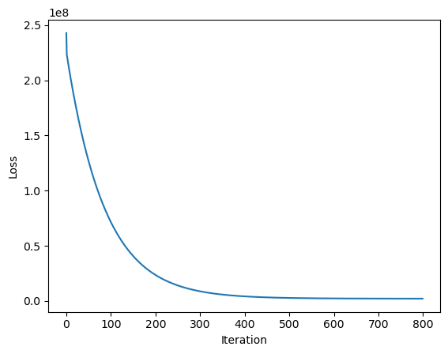
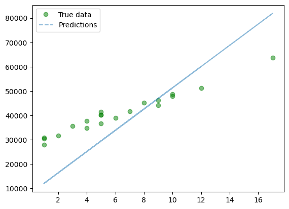

# Linear Regression

## Purpose

- Helps find the relationship between features and label
- Generally 2 dim, but can be scaled to any dimension
- Any statistical model which can fit a linear equation can be approximately classified by linear regression

## General use cases

- Real estate: Predicting house prices based on square footage, number of bedrooms, and location. 
- Marketing: Estimating sales based on advertising budget. 
- Education: Analyzing the relationship between study hours and test scores. 
- Healthcare: Predicting medical costs based on patient factors like age and health conditions. 
- Agriculture: Estimating crop yield based on fertilizer and water levels

## Implementation

```py
import kagglehub

# Download latest version from kaggle
path = kagglehub.dataset_download("hussainnasirkhan/multiple-linear-regression-dataset")
print("Path to dataset files:", path)

# Read csv
df = pd.read_csv(f"{path}" + "/multiple_linear_regression_dataset.csv", sep=",")

#EDA
import matplotlib.pyplot as plt
plt.subplot(2,1,1)
plt.plot(df["experience"], df["income"], 'ro')
plt.subplot(2,1,2)
plt.plot(df["age"], df["income"], 'ro')
plt.show()
```


From the image we can observe that income is dependent on experience.
=== "Python"
    ```py
    import numpy as np
    class linearRegressor:
        def __init__(self):
            self.w = 0.3 
            self.b = 0.4

        def forward(self, X):
            y_pred = [self.w*x + self.b for x in X]
            return y_pred

        def loss(self, y_pred, y_expected):
            y_pred = np.array(y_pred)
            y_expected = np.array(y_expected)
            return np.mean((y_expected-y_pred)**2)
        
        def backward(self, y, X, lr = 0.01):
            f = y - (self.w*X + self.b)
            N = len(X)
            self.w -= lr * (-2 * X.dot(f).sum() / N)
            self.b -= lr * (-2 * f.sum() / N)
            return self.w, self.b
    
    lr = linearRegressor()
    losses = []
    y_train  = df["income"]
    X_train  = np.array(df["experience"])
    y_pred = lr.forward(df["experience"])
    lr.loss(y_pred, df["income"])
    w,b = lr.backward(df["income"], df["experience"])
    for i in range(200):
        y_pred = lr.forward(X_train)
        loss = lr.loss(y_pred, y_train)
        lr.backward(y_train, X_train, lr=0.01)
        losses.append(loss)
    # Plot the learning process
    plt.plot(range(len(losses)), losses)
    plt.xlabel('Iteration')
    plt.ylabel('Loss')
    plt.show()
    ```
    

    ```
    plt.plot(df["experience"], df["income"], 'ro')
    plt.plot(X_train, y_pred, color = "g")
    plt.show()
    ```
    

=== "sklearn"
    ```py
    from sklearn.linear_model import LinearRegression
    from sklearn.metrics import mean_squared_error, r2_score
    model = LinearRegression()
    X_train = np.array(X_train).reshape(-1,1)
    y_train = np.array(y_train).reshape(-1,1)
    model.fit(X_train, y_train)
    y_pred = model.predict(X_train)
    print("Coefficients: \n", model.coef_, model.intercept_)
    # The mean squared error
    print("Mean squared error: %.2f" % mean_squared_error(y_train, y_pred))
    # The coefficient of determination: 1 is perfect prediction
    print("Coefficient of determination: %.2f" % r2_score(y_train, y_pred))

    # Plot outputs
    plt.scatter(X_train, y_train, color="black")
    plt.plot(X_train, y_pred, color="blue", linewidth=3)
    plt.show()
    ```
    

=== "Pytorch"
    ```py
    import torch
    import torch.nn as nn
    class linearRegression(nn.Module):
        def __init__(self, input_dim, output_dim):
            super(linearRegression, self).__init__()
            self.linear = nn.Linear(input_dim, output_dim)
        
        def forward(self, x):
            out = self.linear(x)
            return out
    
    model = linearRegression(1, 1)

    criterion = nn.MSELoss()
    lr = 0.005
    optimizer = torch.optim.SGD(model.parameters(), lr=lr)
    for epoch in range(100):
        inputs = torch.Tensor(X_train).requires_grad_()
        labels = torch.Tensor(y_train)

        optimizer.zero_grad()
        outputs = model(inputs)
        loss = criterion(outputs, labels)
        loss.backward()
        optimizer.step()
        print('epoch {}, loss {}'.format(epoch, loss.item()))
    
    predicted = model(torch.Tensor(X_train).requires_grad_()).data.numpy()
    plt.plot(X_train, y_train, 'go', label='True data', alpha=0.5)
    plt.plot(X_train, predicted, '--', label='Predictions', alpha=0.5)
    plt.legend(loc='best')
    plt.show()
    ```
    


## When does linear regression fail?

- Outliers: Extreme data points that can significantly skew the regression line. 
- Non-linearity: When the relationship between variables isn't linear
- Collinearity: When independent variables are highly correlated with each other, making it difficult to isolate their individual effects. 
- Heteroscedasticity: When the variance of the error terms is not constant across the data range.