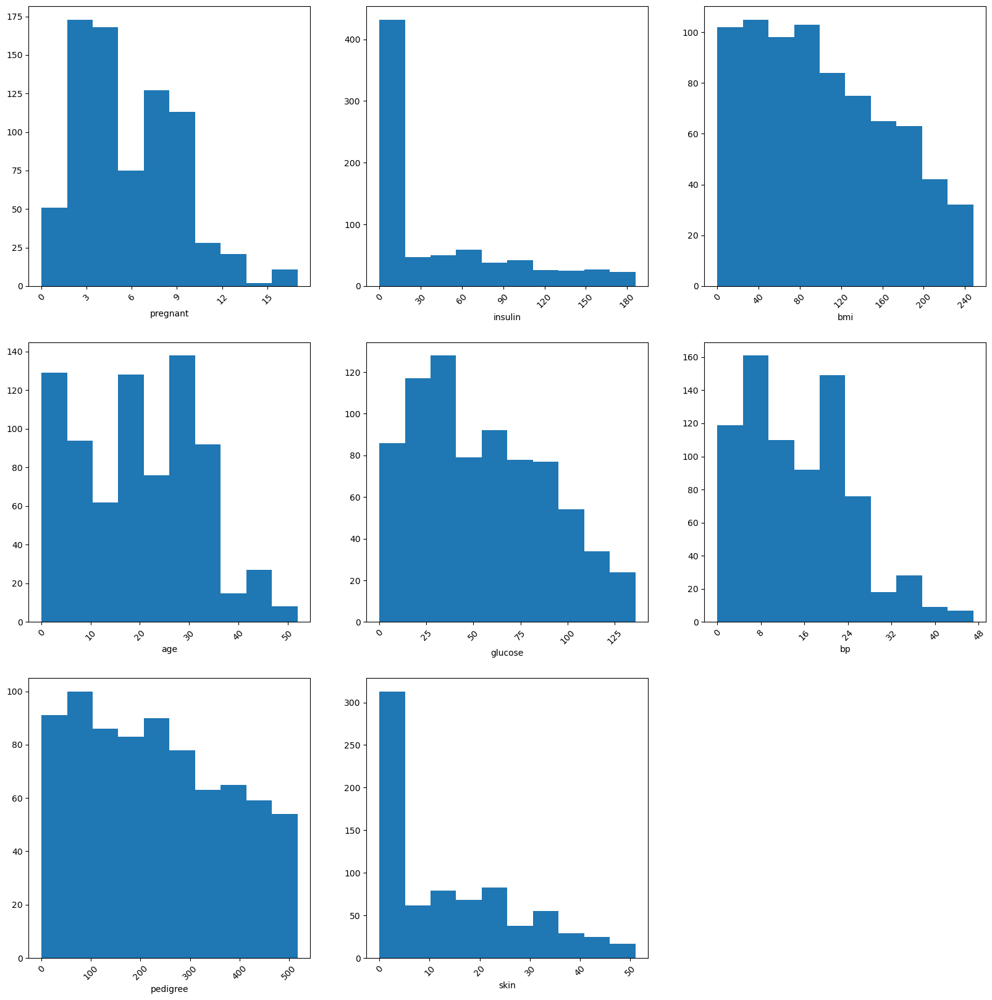
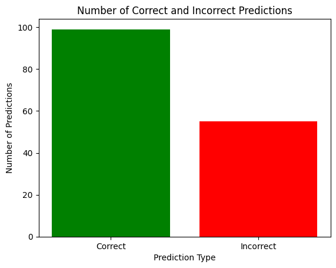

# Logistic Regression

## Purpose

- Helps in classifying a label
- I think of it as a linear classifier which draws a regression line and classifies the point as above or below the line
- Gives you a probibility of belonging to ones class

## General use cases

- Email spam detection: Classify emails as spam or not spam 
- Medical diagnosis: Predict medical conditions based on patient data 
- Fraud detection: Identify data anomalies that indicate fraud 
- Insurance policy approval: Decide whether to approve a new policy based on a driver's history and credit history 


## Implementation
### We are not selecting the skinthickness as it is not required as per domain knowledge. Will write on feature selection in a separate page
```py
import kagglehub

path = kagglehub.dataset_download("uciml/pima-indians-diabetes-database")
print("Path to dataset files:", path)

# Read csv and update the column names
import pandas as pd

col_names = ['pregnant', 'glucose', 'bp', 'skin', 'insulin', 'bmi', 'pedigree', 'age', 'label'] 
pima = pd.read_csv(f"{path}" + "/diabetes.csv", sep=",", names=col_names) # Replcing names to make it easier to work with

#EDA
import matplotlib.pyplot as plt
plt.subplot(2,1,1)
plt.plot(df["experience"], df["income"], 'ro')
plt.subplot(2,1,2)
plt.plot(df["age"], df["income"], 'ro')
plt.show()
```


### What can we observe from the graph

- Most people are at the low insulin levels.
- Number of pregnencies are <= 2 for more than 50% of people.
- The Major age group of the dataset is between 0 - 35.
- We can observe that the skin thickness can be ignored as most of the people have a similar skin thickness


=== "Python"
    ```py
    class LogisticRegression:
        def __init__(self):
            self.w = np.random.randn(len(feature_cols)) * 0.01
            self.b = 0.1
        
        def _sigmod(self, z):
            return 1/(1 + np.exp(-z))

        def forward(self, X):
            y_pred = np.dot(X, self.w) + self.b
            y_pred = self._sigmod(y_pred)
            return y_pred

        def loss(self, y_pred, y_expected):
            epsilon = 1e-9 # used to avoid log 0 cases
            y1 = y_expected * np.log(y_pred + epsilon)
            y2 = (1-y_expected)* np.log(1-y_pred + epsilon)
            return -np.mean(y1+y2)
        
        def backward(self, X, y_pred, y, lr = 0.0001):
            dz = y_pred - y
            dw = (1/len(X))*np.dot(X.T,dz)
            db = (1/len(X)) * np.sum(dz)
            self.w -= lr * dw
            self.b -= lr * db
            return 
        
        def predict(self, X):
            threshold = .5
            y_pred = self.forward(X)
            y_pred = [0 if i < threshold else 1 for i in y_pred]
            return y_pred
    ```

=== "scikit-learn"
    ```py
    from sklearn.linear_model import LogisticRegression
    logreg = LogisticRegression()
    logreg.fit(X_train, y_train)
    y_pred = logreg.predict(X_test)
    ```

=== "Pytorch"
    ```py
    import torch
    import torch.nn as nn
    class logisticRegression(nn.Module):
        def __init__(self, input_dim, output_dim):
            super(logisticRegression, self).__init__()
            self.linear = nn.Linear(input_dim, output_dim)
        
        def forward(self, x):
            out = torch.sigmoid(self.linear(x))
            return out
    
    model = logisticRegression(7,1)
    criterion = nn.BCELoss()
    optimizer = torch.optim.SGD(model.parameters(), lr = 0.0005)
    for epoch in range(100):
        inputs = torch.Tensor(X_train.values).requires_grad_()
        labels = torch.tensor(y_train.values, dtype=torch.float32)

        optimizer.zero_grad()
        outputs = model(inputs).squeeze()
        loss = criterion(outputs, labels)
        loss.backward()
        optimizer.step()
        if epoch%10 == 0:
            print('epoch {}, loss {}'.format(epoch, loss.item()))
    ```

### Predictions
```py
predicted = model(torch.Tensor(X_test.values).requires_grad_()).data.numpy().flatten()
predicted_labels = (predicted > 0.5).astype(int)
correct_predictions = (predicted_labels == y_test.values).sum()
incorrect_predictions = (predicted_labels != y_test.values).sum()

labels = ['Correct', 'Incorrect']
values = [correct_predictions, incorrect_predictions]

plt.bar(labels, values, color=['green', 'red'])
plt.xlabel('Prediction Type')
plt.ylabel('Number of Predictions')
plt.title('Number of Correct and Incorrect Predictions')
plt.show()
```

